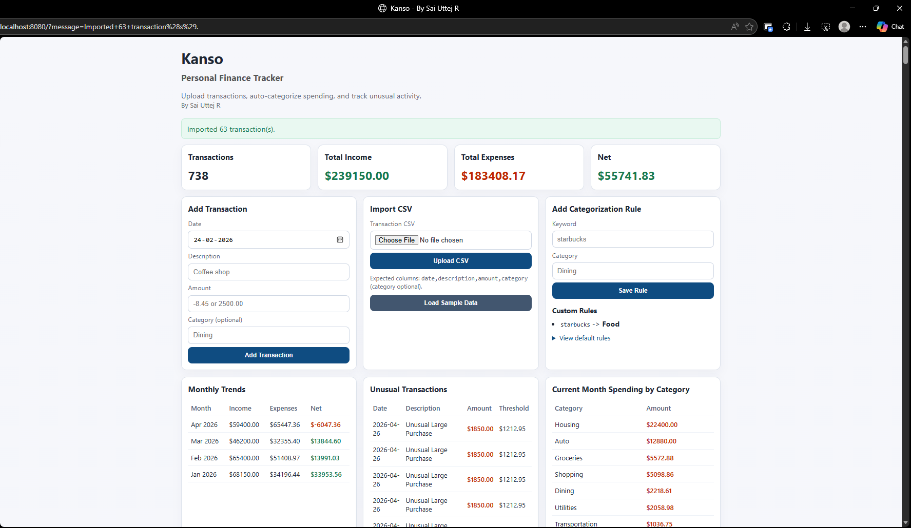

# Kanso
## Personal Finance Tracker
### By Sai Uttej R

A Java Spring Boot web application for intelligent personal finance management with:
- CSV upload/import
- manual transaction entry
- one-click transaction data reset
- rule-based auto-categorization
- monthly income/expense trends
- unusual expense flagging

## Tech Stack

- Java 17
- Spring Boot 3
- Thymeleaf
- Maven

## Run Locally

```bash
mvn spring-boot:run
```

Open:

```text
http://localhost:8080
```


## How to Use

1. **Upload Transactions**
   - Click the "Upload CSV" button on the dashboard
   - Select a CSV file with your transaction data
   - The app will import and auto-categorize your transactions

2. **Add Manual Transactions**
   - Use the "Add Transaction" form on the dashboard
   - Enter the date, description, and amount
   - Leave category blank for manual entry, or it will auto-categorize based on rules

3. **View Dashboard Statistics**
   - See total transactions count
   - Track total income and expenses
   - Monitor your net flow (income - expenses)

4. **Review Categorized Transactions**
   - All transactions are listed with their categories
   - The rule engine automatically categorizes based on keywords
   - Unusual transactions are highlighted with a warning icon

5. **Track Monthly Trends**
   - View income and expense trends by month
   - Analyze spending patterns over time
   - Identify seasonal variations in your finances

6. **Manage Category Rules**
   - Add custom keyword rules to auto-categorize transactions
   - Rules are applied based on keywords in the transaction description
   - Higher priority is given to custom rules over built-in rules

## CSV Format

Upload a CSV with headers:

```csv
date,description,amount,category
2026-02-01,Salary,4200.00,Income
2026-02-02,Walmart Grocery,-78.31,
```

Notes:
- `category` is optional
- supported date formats include `yyyy-MM-dd`, `MM/dd/yyyy`, and `dd-MM-yyyy`
- use negative amounts for expenses and positive amounts for income

## Rule Engine

- Built-in keyword rules (for groceries, utilities, transport, etc.) are included.
- You can add custom keyword rules from the dashboard.
- Custom rules are checked before default rules.

## Unusual Transaction Detection

Expenses are flagged as unusual when they exceed:

`mean(expense_amount) + 2 * stddev(expense_amount)`

This is calculated from currently loaded expense transactions.

## Current Scope

- In-memory data only (no database yet)
- Single-user local usage
- Rule persistence resets on app restart
- "Clear Transaction Data" removes all loaded transactions but keeps rules

## Deployment

### Google Cloud Run (Recommended - Free Tier)

Deploy Kanso to Google Cloud Run with automatic scaling and a generous free tier (2M requests/month).

**Quick Start:**
```bash
./deploy-to-cloud-run.sh
```

Or follow the detailed guide: [CLOUD_RUN_DEPLOYMENT.md](CLOUD_RUN_DEPLOYMENT.md)

**Benefits:**
- ✅ Completely free for typical usage
- ✅ Auto-scales with traffic
- ✅ CI/CD integration with Cloud Build
- ✅ 24/7 uptime with no sleep periods
- ✅ Easy custom domain setup

**Estimated Cost:** $0-5/month for typical usage

For detailed instructions, see: [CLOUD_RUN_DEPLOYMENT.md](CLOUD_RUN_DEPLOYMENT.md)

## Suggested Next Iterations

1. Persist data/rules to PostgreSQL.
2. Add user authentication.
3. Add charts with a JS library (Chart.js/ECharts).
4. Add recurring transaction detection.
